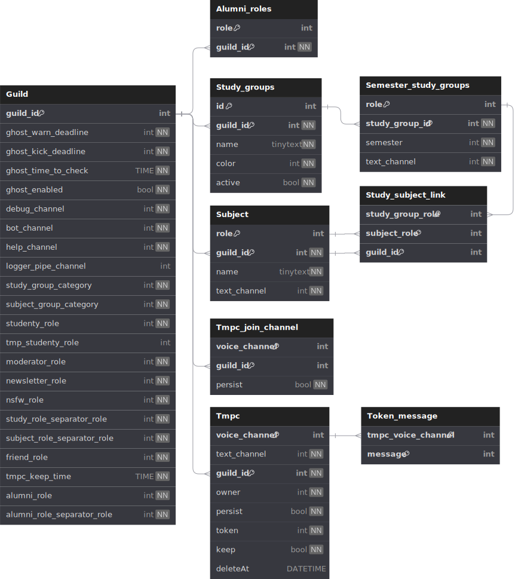

# Database

## Database type

Since the type of data is highly relational (the guild has information, there are links between different data types), we will use a relational database.

We will use a MySQL/MariaDB database and use [sqlx](https://github.com/launchbadge/sqlx) to talk with the database.

## Database communication

The bot shouldn't make the database query himself. Instead, there will be a interface build so that the bot only talk with normal Rust types and the Interface handles the translation between SQL and Rust.

## Database Information

Here is the information saved in the Database:

* guilds
* kick Information
  * warn / Kick deadline (days)
  * time of check
  * list of safeRoles
  * enabled
* singular channels (per guild)
  * debug channel
  * bot chat channel
  * help chat channel
  * nerd voice channel
  * logger pipe channel
  * study group channel category
  * subject channel category
* singular roles (per guild)
  * studenty role
  * tmp student role
  * moderator role
  * newsletter role
  * nsfw role
  * study role separator role
  * subject role separator role
  * friend role
* study groups
  * color
  * active
  * name
* semester study groups
  * text chat
  * role
* subjects
  * text chat
  * role
* study group - subject links
  * default
* tmpc join channels
  * Name Pattern
  * persist
* tmpc channels
  * voice chat
  * text chat
  * owner
  * persist
  * token
  * keep
  * deleteAt
  * token messages

TODO: check if the nerd channel feature shouldn't be removed

## Database Design

The Design is made on [dbdiagram.io](https://dbdiagram.io/) and the sql file is [here](HM_Discord_Bot_Redesign_Database.sql)



DBML:

```DBML
table Guild {
  guild_id int [pk]
  ghost_warn_deadline int [not null]
  ghost_kick_deadline int [not null]
  ghost_time_to_check TIME [not null]
  ghost_enabled bool [not null]
  debug_channel int [not null]
  bot_channel int [not null]
  help_channel int [not null]
  logger_pipe_channel int
  study_group_category int [not null]
  subject_group_category int [not null]
  studenty_role int [not null]
  tmp_studenty_role int [null]
  moderator_role int [not null]
  newsletter_role int [not null]
  nsfw_role int [not null]
  study_role_separator_role int [not null]
  subject_role_separator_role int [not null]
  friend_role int [not null]
  tmpc_keep_time TIME [not null]
}

table Study_groups {
  id int [pk, increment]
  guild_id int [ref: > Guild.guild_id, not null]
  name tinytext [not null]
  color int [not null]
  active bool [not null, default: True]

  indexes {
    (guild_id, name) [unique]
  }
}

table Semester_study_groups {
  role int [pk]
  study_group_id int [ref: > Study_groups.id, not null]
  semester int [not null]
  text_channel int [unique, not null]

  indexes {
    (study_group_id, semester) [unique]
  }
}

table Subject {
  role int [pk]
  guild_id int [ref: > Guild.guild_id, not null]
  name tinytext [not null]
  text_channel int [unique, not null]

  indexes {
    (guild_id, name) [unique]
  }
}

table Study_subject_link {
  study_group_role int [pk, ref: > Semester_study_groups.role]
  subject_role int [pk, ref: > Subject.role]
}

table Tmpc_join_channel {
  voice_channel int [pk]
  guild_id int [ref: > Guild.guild_id]
  persist bool [not null]
}

table Tmpc {
  voice_channel int [pk]
  text_channel int [unique, not null]
  guild_id int [ref: > Guild.guild_id, not null]
  owner int [not null]
  persist bool [not null]
  token int [not null]
  keep bool [not null, default: False]
  deleteAt DATETIME [null]
}

table Token_message {
  tmpc_voice_channel int [pk, ref: > Tmpc.voice_channel]
  message int [pk]
}

table Main_log_pip_channel {
  id int [pk]
}
```